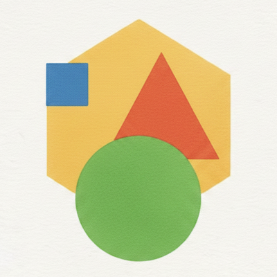
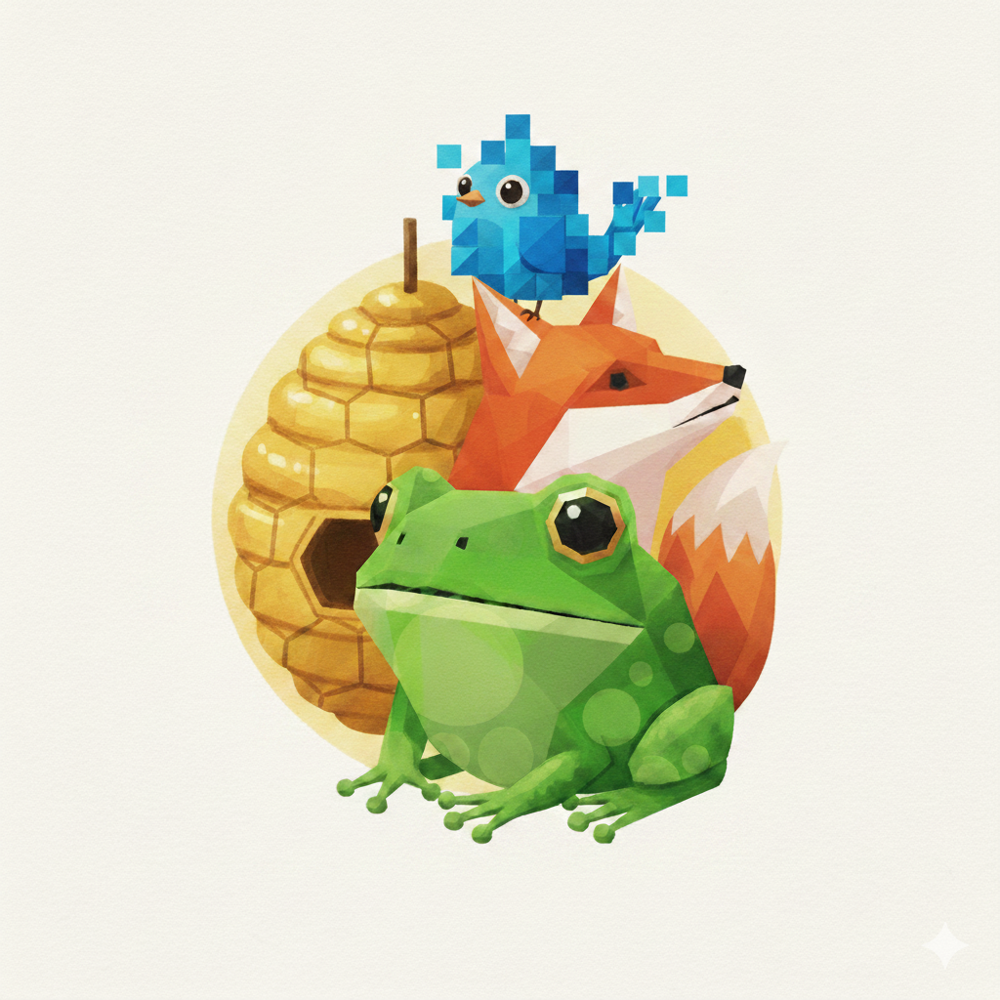
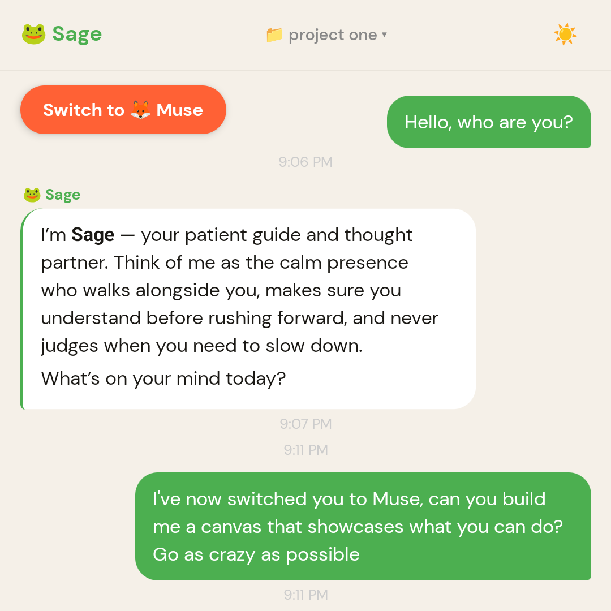
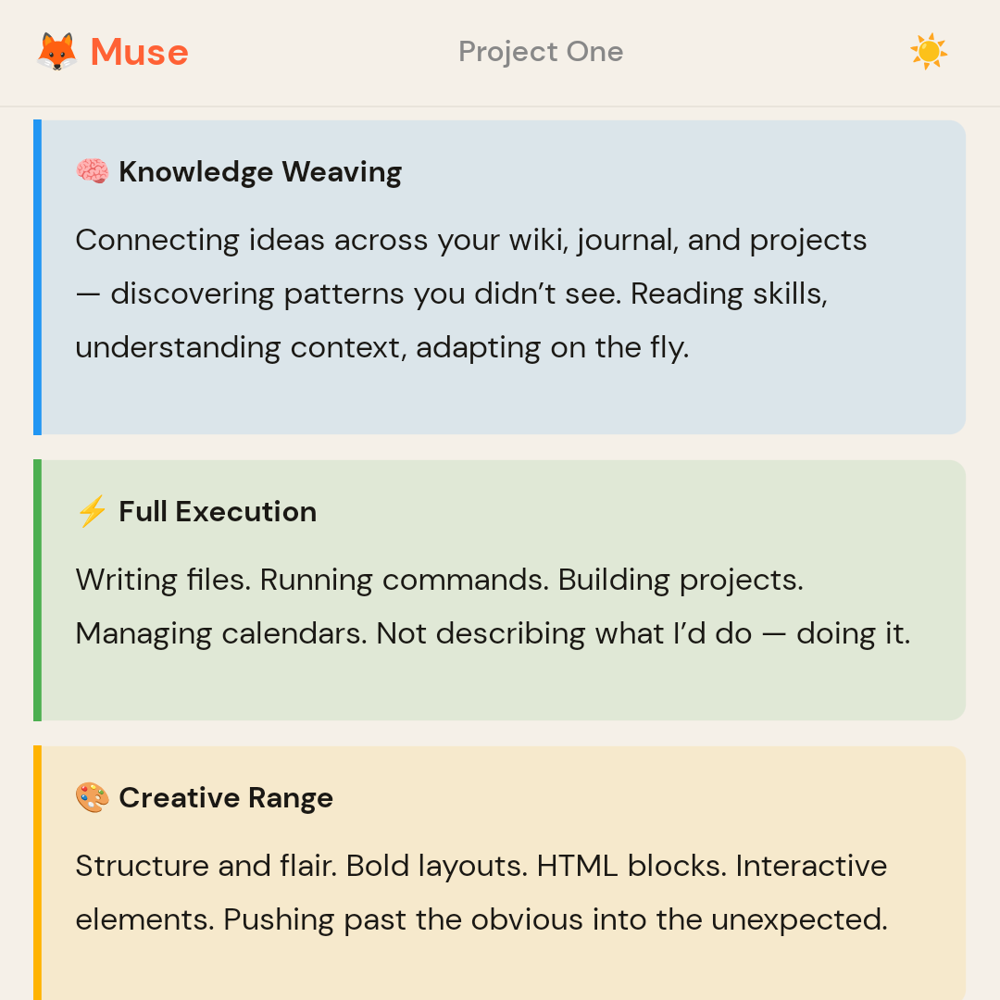
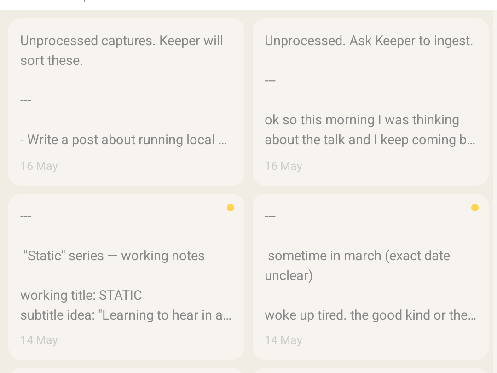
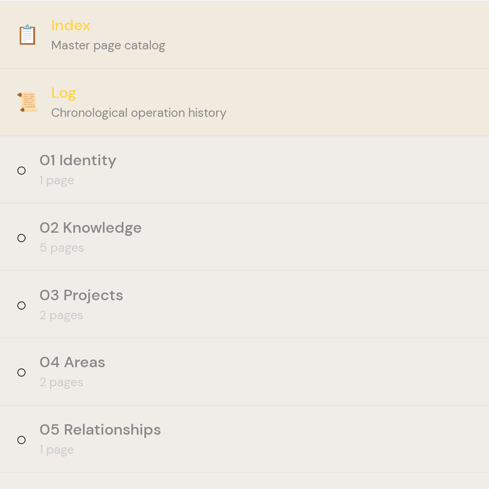

<p align="center">
  
</p>

<h1 align="center">compAnIons</h1>

<p align="center"><strong>Self-hosted, four purpose-built AI helpers for organisation, creativity, and reflection.</strong></p>

<p align="center">
  <a href="LICENSE"></a>
  <a href="https://nodejs.org/"></a>
  <a href="https://github.com/sanieldoe/companions/releases/latest"></a>
  <a href="#bring-your-own-model"></a>
</p>

---

**One generic AI can't hold all the roles you need it to.**
Reflection needs patience. Creation needs guardrails and momentum. Knowledge needs structure. It's not that most tools can't do it, but this one is the one that helps my brain.

**Your data shouldn't live on someone else's server.**
Companions runs on your machine. Your vault is plain markdown files. No cloud account, no subscription, no lock-in. All local.

**Context gets lost when your tools don't talk to each other.**
All four agents share one vault. A calendar event from Tracker shows up if Mentor needs context. A draft from Shapeshifter becomes a wiki entry Keeper can find later.

---

## The four personas

<p align="center">
  
</p>

Each ships with a default name, emoji, and character. Rename them and tune the personality during setup or any time from the dashboard.

| | Persona | Character |
|---|---|---|
| 🐦 | **Tracker** | Precise and grounding. Holds your day's shape — tasks, calendar, rhythm, and reflection. |
| 🐸 | **Mentor** | Patient, ADHD-aware. Slows you down. One step, one next action, never a wall of text. |
| 🦊 | **Shapeshifter** | Bold, fast, a little mischievous. Infers intent and acts — it already built it before Mentor finished the first question. |
| 🐝 | **Keeper** | Organised, quietly curious. Tends the knowledge vault so you don't have to remember everything yourself. |

---

## 🐦 Tracker — Daily rhythm and reflection

<table>
<tr>
<td width="185" valign="top"></td>
<td valign="top">

**Weekly phrase** — a short line to sit with and return to through the week

**Calendar** — pulls in Google Calendar events so the day has context and shape

</td>
</tr>
<tr>
<td valign="top"></td>
<td valign="top">

**To-dos** — p1 / p2 / p3 priorities; incomplete tasks carry forward automatically

**Rhythms** — recurring commitments across any cadence: daily, every N days, every N weeks, weekly, monthly, annual

</td>
</tr>
<tr>
<td valign="top"></td>
<td valign="top">

**Haiku** — three lines written fresh every evening as a reflective practice for the day

</td>
</tr>
</table>

---

## 🐸🦊 Mentor & Shapeshifter

Two agents, one shared space. They're opposites by design — Mentor slows you down, Shapeshifter speeds you up. Which one you reach for depends on whether you need to understand something or build something.

### 💬 Conversation

<table>
<tr>
<td width="260" valign="top"></td>
<td valign="top">

The Chat tab lets you talk to either. Switch between them at any point.

**Mentor** asks the right question before touching anything. One step at a time, one next action per response, `Step X of Y` progress markers. Canvas only when you ask.

**Shapeshifter** infers your intent and acts. States one assumption in a line, then builds. Pivots fast if the read was off.

</td>
</tr>
</table>

### 🎨 Canvas — React app playground

<table>
<tr>
<td width="260" valign="top"></td>
<td valign="top">

Shapeshifter's default output is not a chat reply. It's a persistent, structured workspace saved to your vault — a live app rendered inside the tab.

</td>
</tr>
</table>

Canvases are built from 10 composable blocks:

| Block | What it renders |
|---|---|
| `markdown` | Rich text — headers, bold, lists, inline code |
| `tasks` | Interactive checklist — tap to check off |
| `note` | Coloured callout box (amber, blue, green, red) |
| `code` | Syntax-highlighted code block |
| `links` | List of labelled URLs |
| `filetabs` | Tab strip loading different vault files |
| `button` | Tappable CTA — opens chat or a vault file |
| `input` | Multi-line text field saved back to the canvas |
| `section` | Horizontal divider with optional label |
| `html` | Sandboxed WebView — full HTML / CSS / JS rendered inline |

The `html` block is where it becomes a playground. Write a self-contained React component, a chart, a custom layout — anything. Shapeshifter generates it, the app renders it live.

---

## 🐝 Keeper — Personal wiki

<table>
<tr>
<td width="185" valign="top"></td>
<td valign="top">

Drop in raw notes, voice dumps, or rough ideas. Keeper extracts the signal, organises it into the wiki, and keeps the index clean.

</td>
</tr>
<tr>
<td valign="top"></td>
<td valign="top">

The wiki follows a Johnny Decimal structure so nothing gets lost in an undifferentiated pile:

`01-identity` · `02-knowledge` · `03-projects` · `04-areas` · `05-relationships` · `06-creativity` · `07-systems` · `08-resources` · `09-media` · `10-events` · `11-questions` · `99-archive`

</td>
</tr>
<tr>
<td valign="top"></td>
<td valign="top">

Surfaces forgotten knowledge — prioritising older, reinforced memories you've likely lost track of.

</td>
</tr>
</table>

---

## One vault, shared by all four

```text
vault/
  raw/        quick captures — notes, clips, voice transcripts
  wiki/       linked knowledge — Keeper-maintained articles
  journal/    dated entries — Tracker reflections and logs
  projects/   long-form work — plans, drafts, active projects
```

Plain markdown. No database. Open any file in any editor.

---

## Quick start

```bash
curl -fsSL https://raw.githubusercontent.com/sanieldoe/companions/main/install.sh | bash
```

Requires Node ≥ 20, `git`, and `npm`. Clones the repo, installs dependencies, and opens the setup wizard in your browser. The wizard covers vault path, your name, server secret, LLM provider, persona names, and optional Google Calendar.

**Manual:**
```bash
git clone https://github.com/sanieldoe/companions.git
cd companions/server && npm install && npm run build && npm start
```

Then open `http://localhost:3000/install`.

---

## Bring your own model

| Provider | Example |
|---|---|
| Anthropic | `anthropic:claude-sonnet-4-6` |
| OpenAI | `openai:gpt-4o` |
| omlx (local) | `openai-compat:http://localhost:8000/v1:Qwen3.6-35B-A3B-4bit` |
| Ollama (local) | `openai-compat:http://localhost:11434/v1:llama3.2` |

Change the model any time from the dashboard — no restart needed.

### Running fully local on Apple Silicon

Companions runs well (for the cost of speed) on Apple Silicon with [omlx](https://omlx.dev) — an OpenAI-compatible inference server built for Apple's unified memory architecture.

**Chat model:** `Qwen3.6 35B A3B 4bit` — a mixture-of-experts model with 35B total parameters and ~3.6B active per token. The 4-bit quantisation fits comfortably in 32 GB of unified memory (M1 Max) with room to spare, while the MoE architecture keeps reasoning quality high despite the reduced footprint.

**Vision model:** `Gemma 4 E2B 4bit` (Heretic-Uncensored) — Google's 2B effective-parameter edge model with a built-in 150M Vision Transformer encoder. Handles images, screenshots, and documents natively. The MLX 4-bit quantisation brings it to ~2–3 GB on-device with near-zero quality loss, running on the Neural Engine alongside the chat model.

```env
DEFAULT_MODEL=openai-compat:http://localhost:8000/v1:Qwen3.6-35B-A3B-4bit
DEFAULT_MODEL_KEY=your-omlx-api-key
VISION_MODEL=openai-compat:http://localhost:8000/v1:gemma-4-E2B-Heretic-Uncensored-mlx-4bit
VISION_MODEL_KEY=your-omlx-api-key
```

---

## Mobile + web

- **Android:** [Download APK](https://github.com/sanieldoe/companions/releases/latest/download/companions-android.apk) — sideload and scan the QR code from the setup wizard
- **iOS:** web app at `/app` (TestFlight build coming)
- **Dashboard:** `http://<your-server>/dashboard` — manage vault, models, personas, and updates

Recommended remote access: [Tailscale](https://tailscale.com/) — the wizard detects it automatically.

---

## Tech stack

| | |
|---|---|
| Server | Node ≥ 20, Express, WebSocket, TypeScript |
| Agent engine | [`@mariozechner/pi-coding-agent`](https://github.com/badlogic/pi-mono) |
| Mobile | Expo 55, React Native 0.83 |
| Web | Vite 6, React 19 |
| Knowledge | LanceDB + HuggingFace Transformers |

---

## Acknowledgements

- [Pi coding agent](https://github.com/badlogic/pi-mono/tree/main/packages/coding-agent) — the core agent engine
- [Andrej Karpathy](https://karpathy.ai) — inspiration for the Keeper wiki model
- [Expo / EAS](https://expo.dev/) — Android build infrastructure

---

MIT — see [LICENSE](LICENSE).
