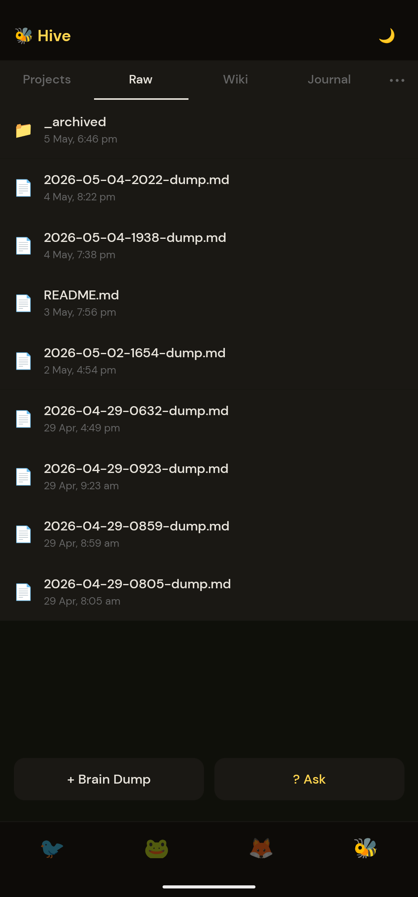
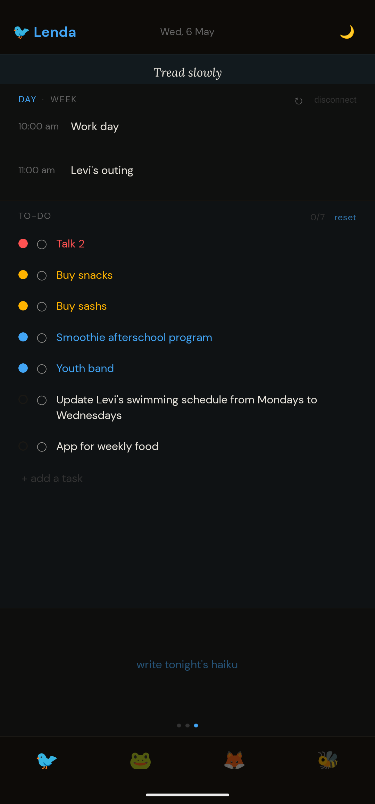
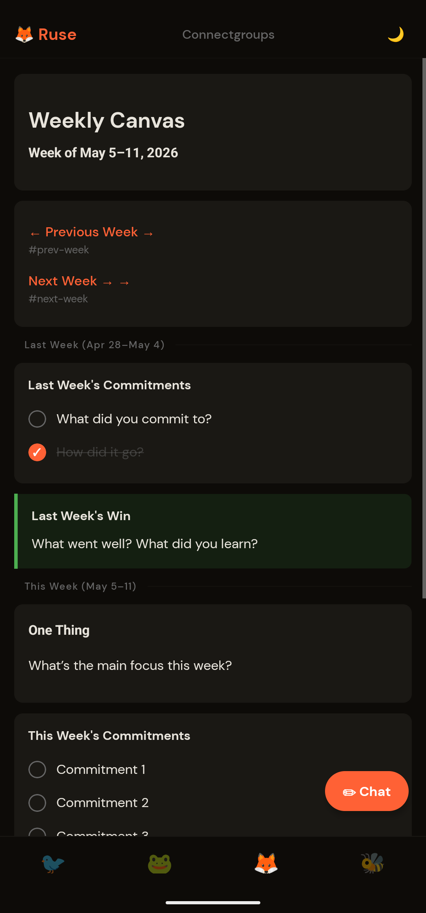

<p align="center">
  
</p>

<h1 align="center">Companions</h1>

<p align="center"><strong>One Vault. Four Agents. One App.</strong></p>

<p align="center">
  <a href="LICENSE"></a>
  <a href="https://nodejs.org/"></a>
  <a href="https://github.com/sanieldoe/companions/releases/latest"></a>
  <a href="#llm-support"></a>
</p>

---

Most AI tools give you one generic chatbot. Companions gives you four agents built around how you actually think, create, reflect, and plan — all sharing a single vault of plain files on your own machine.

<p align="center">
  
</p>

<p align="center">
  
  &nbsp;
  
  &nbsp;
  
</p>

---

## The four agents

<p align="center">
  
</p>

### Tracker — The Monk Journal

Most productivity systems push you to do more. Tracker is built around the opposite idea: slow down, look back, and prepare with intention.

Inspired by structured monk-style journalling, Tracker gives you a daily rhythm of reflection and preparation. It reads your vault — your notes, past entries, open projects — and helps you begin each day with clarity and close it with honesty. No scattered task lists. A single, grounded practice.

> *What did I actually do today? What's worth carrying forward? What do I need to let go of?*

### Mentor — Step by Step

The best thinking rarely happens fast. Mentor is designed to slow you down.

Instead of handing you an answer, Mentor walks beside you — asking the next right question, pointing out what you might have missed, and building understanding one step at a time. Use it for hard problems, learning something new, debugging, or any conversation worth having carefully.

> *Don't skip ahead. Let's work through this properly.*

### Shapeshifter — The Limitless Canvas

Some ideas don't fit in a chat box. Shapeshifter is your open creative workspace.

Brainstorm without structure. Draft without constraints. Generate, remix, break apart, and rebuild. Shapeshifter takes whatever shape the work needs — from rough first drafts to polished outputs — and leaves the result in your vault for everything else to see.

> *What if we tried it this way instead?*

### Keeper — The Personal Wiki

Inspired by [Andrej Karpathy's approach to personal knowledge](https://karpathy.ai), Keeper turns your vault into a living, interconnected record of what you know.

Every note you share, every idea you drop in, gets woven into a linked wiki — cleaned up, cross-referenced, and retrievable. Keeper is the agent that remembers so you don't have to, and surfaces the right context when you need it.

> *You wrote about this six months ago. Want me to bring it in?*

---

## One vault, shared by all four

Every agent reads and writes the same vault. A reflection captured in Tracker shows up when Mentor needs context. A half-formed idea Shapeshifter drafted becomes a wiki entry Keeper can reference later.

```text
vault/
  raw/        quick captures — unprocessed notes, clips, voice transcripts
  wiki/       linked knowledge — Keeper-maintained articles and references
  journal/    dated entries — Tracker reflections, daily logs, check-ins
  projects/   long-form work — plans, drafts, talks, active projects
```

Plain markdown files on disk. No database, no lock-in. Open any file in any editor.

A fresh setup creates:

```text
~/companions-vault/
├── raw/.keep
├── wiki/welcome.md
├── journal/.keep
└── projects/.keep
```

---

## Quick start

```bash
curl -fsSL https://raw.githubusercontent.com/sanieldoe/companions/main/install.sh | bash
```

The script checks for Node ≥ 20, clones the repo, installs dependencies, and drops you into the setup wizard.

<details>
<summary>What the install script does</summary>

1. Detects your OS (macOS / Linux — Windows users: use WSL).
2. Checks `node`, `git`, `npm` — prints install instructions if anything is missing.
3. Clones `https://github.com/sanieldoe/companions.git` into `~/companions/` (or pulls if it already exists).
4. Runs `npm install` in `server/`, `app/`, and `web/`.
5. Launches `npm run setup` — an interactive wizard that configures your LLM provider, vault location, agent names and emoji, port, and Tailscale pairing.

</details>

### Manual install

```bash
git clone https://github.com/sanieldoe/companions.git
cd companions/server
npm install
npm run setup
npm start
```

Then open:

- **Web app:** `http://localhost:3000/app`
- **Mobile app:** `cd ../app && npx expo start`

---

## Bring your own model

Companions has no default provider and no bundled model. Setup asks you to configure one.

| Provider | Chat | Tool use | Streaming | Example |
|---|:---:|:---:|:---:|---|
| Anthropic | ✅ | ✅ | ✅ | `anthropic:claude-sonnet-4-6` |
| OpenAI | ✅ | ✅ | ✅ | `openai:gpt-4o` |
| OpenAI-compatible / local | ✅ | ⚠️ model-dependent | ✅ | `openai-compat:http://localhost:11434/v1:llama3.2` |

Example `server/.env` values:

```env
# Anthropic
DEFAULT_MODEL=anthropic:claude-sonnet-4-6
DEFAULT_MODEL_KEY=sk-ant-...

# OpenAI
DEFAULT_MODEL=openai:gpt-4o
DEFAULT_MODEL_KEY=sk-...

# Local (Ollama etc.)
DEFAULT_MODEL=openai-compat:http://localhost:11434/v1:llama3.2
DEFAULT_MODEL_KEY=
```

See `server/.env.example` for the full template.

---

## Mobile + web

- **Android:** [Download the latest APK](https://github.com/sanieldoe/companions/releases/latest/download/companions-android.apk)
- **iOS:** use the web app for now (no TestFlight / App Store in v1)
- **Web:** available at `/app`

### Sideloading the Android APK

1. On your Android device, go to **Settings → Apps → Special app access → Install unknown apps** and allow installs from your browser or Files app.
2. Download `companions-android.apk` from the link above.
3. Tap the file and follow the install prompt.
4. On first launch, scan the QR code printed by `npm run setup`, or enter your server URL and access token manually.

The app pairs to your server via QR code or manual URL + token entry — no cloud account required.

---

## Authentication

Companions uses **opaque bearer tokens**, not JWTs.

```bash
cd server
npm run token:list
npm run token:issue -- --label "phone"
npm run token:revoke -- --id <uuid>
npm run token:rotate-all
```

Primary endpoints:

- `GET /api/health`
- `POST /api/auth/verify`
- `GET /api/personas`

---

## Networking

The recommended remote-access path is **Tailscale** — the setup wizard detects it and uses your Tailnet hostname as the connection URL for mobile pairing.

See `docs/networking.md`, `docs/self-hosting.md`, and `docs/vault-sync.md` for more.

**Multi-device:** you can pair as many devices as you like to one server. The vault lives on the server machine. If you want it mirrored elsewhere, use Syncthing or any file-sync tool you trust.

---

## Development

```bash
cd server && npm run typecheck && npm test
cd ../app && npm run typecheck
cd ../web && npx tsc --noEmit
```

CI runs typechecks and server tests on every PR.

See [CONTRIBUTING.md](CONTRIBUTING.md), [SECURITY.md](SECURITY.md), and [CODE_OF_CONDUCT.md](CODE_OF_CONDUCT.md).

---

## Repo layout

```text
app/        React Native / Expo mobile app
web/        Vite + React web app
server/     Express + WebSocket backend
skills/     Agent skill definitions (markdown)
personas/   Agent persona files (created by setup)
docs/       Networking, sync, self-hosting, extension notes
```

---

## Roadmap

**Done**
- Four-agent architecture with shared vault
- Setup wizard: provider, vault, personas, tokens, Tailscale
- Opaque bearer-token auth with CLI management
- Android APK with QR pairing
- Install script

**Next**
- Signed APK release automation
- iOS TestFlight build
- Responsive web pairing flow
- Long-term self-hosting polish

---

## Acknowledgements

- [Andrej Karpathy](https://karpathy.ai) — inspiration for the Keeper wiki model
- [@clack/prompts](https://github.com/bombshell-dev/clack) — TUI setup wizard
- [Expo / EAS](https://expo.dev/) — Android build and distribution
- [Tailscale](https://tailscale.com/) — recommended remote access tunnel
- [LanceDB](https://lancedb.github.io/lancedb/) — local vector search for knowledge retrieval

---

## License

MIT — see [LICENSE](LICENSE).
