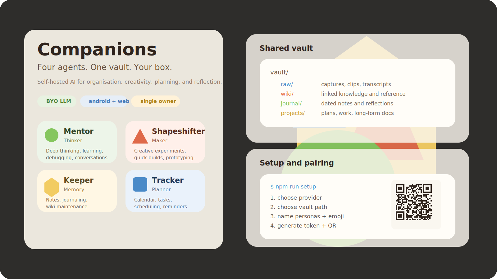
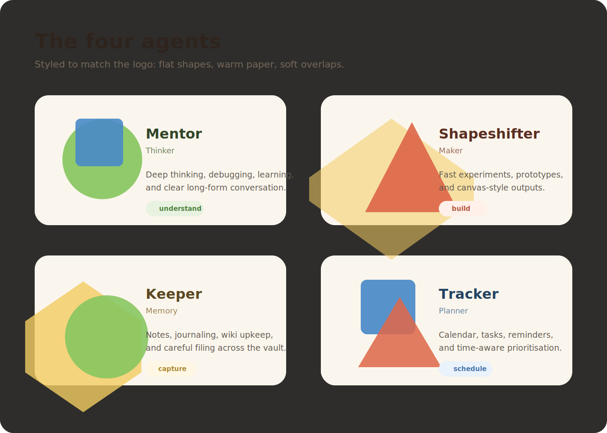
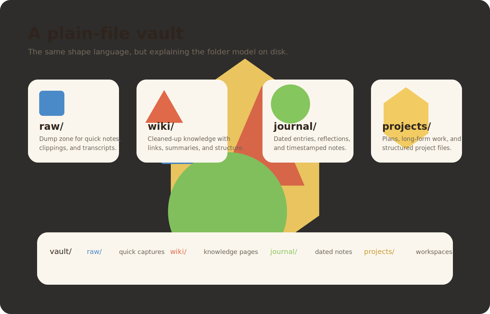

# Companions

> Four agents. One vault. Your box.

Companions is a self-hosted, four-tab AI agent system for organisation, creativity, and reflection. Instead of a single generic chatbot, you get four specialised companions that share one local markdown vault on disk.

**Current scope:** single owner, multiple devices, Android + web, bring your own model.



---

## What it is

Companions runs four AI agents — each with its own tab — over a shared local vault of notes, wiki pages, journal entries, and project files.

All agents can read and write the same vault, so information captured in one tab is available everywhere else.

The project includes:

- `server/` — Express + WebSocket backend
- `app/` — React Native / Expo mobile app
- `web/` — Vite + React web app
- `skills/` — agent skill definitions
- `personas/` — persona files generated by setup

---

## The four agents

| Tab | Role | What it does |
|---|---|---|
| **Mentor** | Thinker | Deep thinking, learning, debugging, long conversations |
| **Shapeshifter** | Maker | Creative experiments, quick builds, prototyping, canvas outputs |
| **Keeper** | Memory | Notes, journaling, brain dumps, wiki maintenance |
| **Tracker** | Planner | Calendar, scheduling, tasks, reminders |

These four personas are intentional. You can rename them and choose new emoji during setup, but the core project ships with exactly four slots.



See `docs/extending-personas.md` if you want to fork the project and add a fifth.

---

## Quick start

### Manual install

```bash
git clone https://github.com/sandoe/companions.git
cd companions/server
npm install
npm run setup
npm start
```

Then open:

- web app: `http://localhost:3000/app`
- mobile app: `cd ../app && npx expo start`

### Installer script

The repo also includes `install.sh`:

```bash
./install.sh
```

It checks prerequisites, clones or updates the repo, installs dependencies in `server/`, `app/`, and `web/`, then hands off to `npm run setup`.

---

## Vault structure

Your vault is a normal local folder chosen during setup.

```text
vault/
  raw/        dump zone — unprocessed notes, clips, transcripts
  wiki/       compiled knowledge — agent-authored articles with backlinks
  journal/    dated entries — daily logs, reflections, timestamped notes
  projects/   project files — plans, talks, long-form work
```

A fresh setup creates:

```text
~/companions-vault/
├── raw/.keep
├── wiki/welcome.md
├── journal/.keep
└── projects/.keep
```

Companions does **not** lock your data into a database format. These are plain files on disk.



---

## LLM support

Companions is **bring-your-own-LLM**.

There is **no default provider** and no bundled model. Setup requires you to configure one.

Supported setup paths today:

| Provider | Status | Example |
|---|---|---|
| Anthropic | supported | `anthropic:claude-sonnet-4-6` |
| OpenAI | supported | `openai:gpt-4o` |
| OpenAI-compatible / local | supported | `openai-compat:http://localhost:11434/v1:llama3.2` |

Example `server/.env` values:

```env
# Anthropic
DEFAULT_MODEL=anthropic:claude-sonnet-4-6
DEFAULT_MODEL_KEY=sk-ant-...

# OpenAI
DEFAULT_MODEL=openai:gpt-4o
DEFAULT_MODEL_KEY=sk-...

# Local (Ollama etc.)
DEFAULT_MODEL=openai-compat:http://localhost:11434/v1:llama3.2
DEFAULT_MODEL_KEY=
```

See `server/.env.example` for the full template.

---

## Mobile + web

- **Android:** supported via Expo / EAS APK workflow
- **iOS:** use the web app for now
- **Web:** supported at `/app`

The mobile app pairs to your server using:

- a QR code printed by `npm run setup`, or
- manual entry of server URL + opaque access token

---

## Authentication

Companions uses **opaque bearer tokens**, not JWTs.

Useful commands:

```bash
cd server
npm run token:list
npm run token:issue -- --label "iPad"
npm run token:revoke -- --id <uuid>
npm run token:rotate-all
```

Primary endpoints:

- `GET /api/health`
- `POST /api/auth/verify`
- `GET /api/personas`

---

## Networking

The recommended remote-access path is **Tailscale**.

The setup wizard detects it automatically and can use your Tailnet hostname as the mobile connection URL.

More detail:

- `docs/networking.md`
- `docs/self-hosting.md`
- `docs/vault-sync.md`

---

## Multi-device + sync

Companions is **single-owner, multi-device**.

You can pair multiple devices to one server, but Companions does **not** sync your vault between machines.

If you want the vault mirrored across multiple computers, use Syncthing or your preferred file-sync tool.

See `docs/vault-sync.md`.

---

## Repo files

```text
app/        React Native / Expo mobile app
web/        Vite + React web app
server/     Express + WebSocket backend
skills/     Agent skill definitions (markdown)
personas/   Agent persona files (created by setup)
docs/       Networking, sync, self-hosting, extension notes
```

---

## Development

```bash
cd server && npm run typecheck
cd ../app && npm run typecheck
cd ../web && npx tsc --noEmit
```

CI runs typechecks on PRs.

See:

- `CONTRIBUTING.md`
- `SECURITY.md`
- `CODE_OF_CONDUCT.md`
- `CHANGELOG.md`

---

## Roadmap

### Done

- four-tab architecture
- shared local vault model
- setup wizard with provider / vault / persona / token flow
- opaque bearer-token auth
- Android pairing flow with QR + manual entry
- token CLI scripts
- install script

### Next

- polished screenshots and demo media
- release automation for signed Android APKs
- more setup tests
- responsive web pairing parity
- long-term self-hosting polish

---

## License

MIT — see `LICENSE`.
